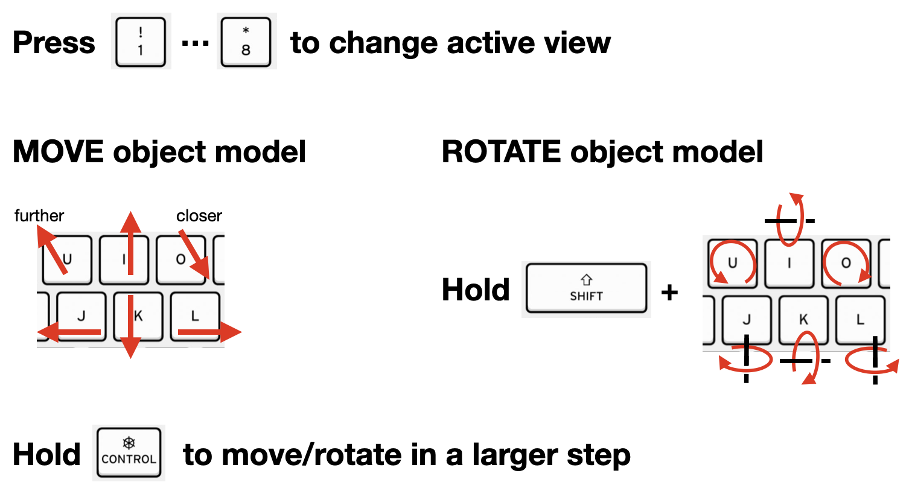

## Installation
#### 1. Download and unzip following files
Sample data: https://drive.google.com/file/d/137uO2Ya63cpf1RspiE3rbsAE-btkIovG/view?usp=sharing

YCBV Models: https://drive.google.com/file/d/1lsxEe8amxp4pPq-IE4AMMgR3dfSbDOFQ/view?usp=sharing


#### 2. Move the folder `models` into the `data` folder. The directory should look like this:
```
- data
    - scene_221012114441
    - models
```

#### 3. Clone this git
```
git clone https://github.com/dkguo/dataset_tools
cd dataset_tools
```

#### 4. Change `dataset_path` in `config.py` to the path of `data` folder
```
dataset_path = 'YOUR_PATH/data'
```

#### 5. Create environment and install necessary packages
```
conda create --name annotate python=3.6
conda activate annotate
pip install -r requirements.txt
```

#### 6. Make sure OpenGL can be properly imported
##### If following line of code returns nothing, which means python can import OpenGL properly, you can skip this section.
```
python -c "from OpenGL.GL import *"
```

##### If you get the error like `'Unable to load OpenGL library'`, try the troubleshoot code below:
##### For Ubuntu Linux: you may following packages to run pyOpenGL
```
sudo apt-get install libosmesa6-dev freeglut3-dev
```

##### For MacOS:
```
brew install glew glfw

# get path of OpenGL
python3 -c "import OpenGL; print(OpenGL.__path__)"

# you will get a path like this
['/opt/anaconda3/envs/annotate/lib/python3.6/site-packages/OpenGL']

# open YOUR_OPENGL_PATH_ABOVE/platform/ctypesloader.py
vi /opt/anaconda3/envs/annotate/lib/python3.6/site-packages/OpenGL/platform/ctypesloader.py

# change code line 35
# old code
#fullName = util.find_library( name )
# new code
fullName = '/System/Library/Frameworks/OpenGL.framework/OpenGL'
```


## Annotation Tool Usage
#### run the annotate_obj_pose.py script
```
python -m annotate.annotate_obj_pose --scene_name {scene_name} --start_frame {num}

# for example (also the default values)
python -m annotate.annotate_obj_pose --scene_name scene_220603104027 --start_frame 20
```

#### Control Keys


